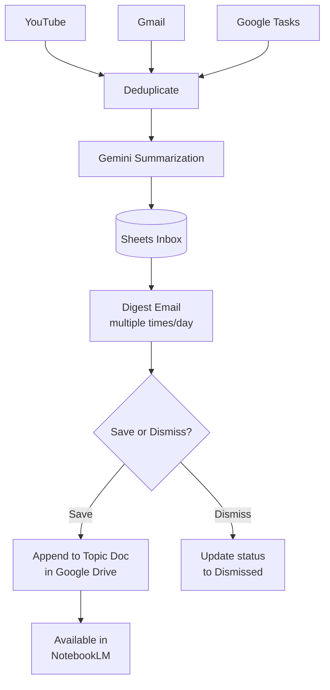
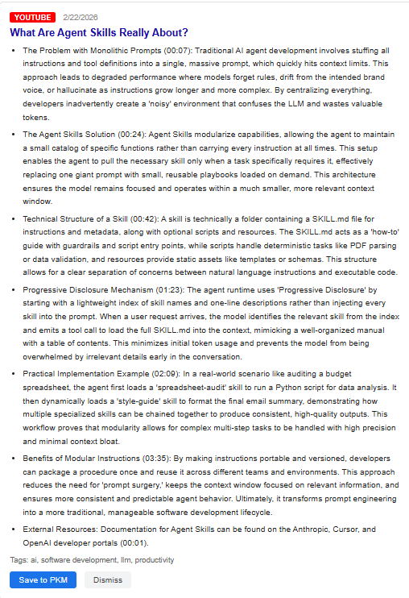
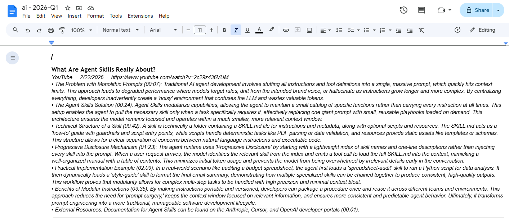
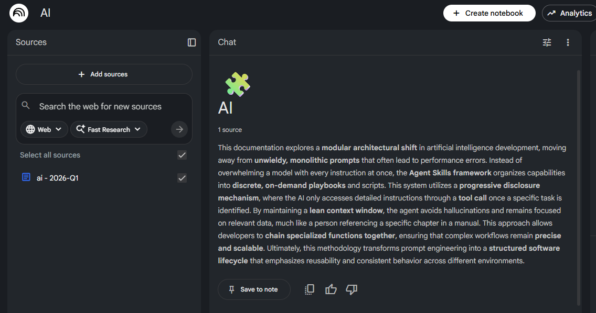

# PKM System

A personal knowledge management system built on Google Apps Script. Automatically collects content from YouTube, Gmail, and Google Tasks, summarizes it with Gemini, and routes summaries to you for approval via email. Approved items are committed to structured Google Docs in Drive, making your accumulated knowledge queryable via NotebookLM.

## How It Works

The system operates in two phases separated by a deliberate human approval step — nothing reaches permanent storage without you explicitly saving it.



**Phase 1 — Collect:** Time-driven triggers poll each source, deduplicate against previously processed IDs, summarize new items via Gemini, and write them to a Sheets inbox.

**Digest Delivery:** A separate trigger composes an HTML email of all pending items with [Save to PKM] and [Dismiss] action links.

**Phase 2 — Commit:** Clicking a link hits a deployed Apps Script web app. Save appends a formatted entry to the active quarterly Topic Doc in Drive; Dismiss updates the row status.

## Screenshots

**Digest email** — summarized items arrive with one-click Save and Dismiss actions:



**Topic Doc** — approved items are appended as structured entries in a quarterly Google Doc:



**NotebookLM** — Topic Docs become notebook sources, making your knowledge queryable:



## Architecture

Single Google Apps Script project — no servers, no hosting, no external infrastructure. All execution happens on Google's servers via time-driven triggers.

| File | Responsibility |
|---|---|
| `Code.js` | Trigger entry points (`runFrequentPipeline`, `runDailyPipeline`) |
| `Config.js` | Constants, Script Property accessors, deduplication store |
| `Utils.js` | ID generation, HTML escaping, item normalization |
| `YouTube.js` | YouTube playlist connector |
| `Gmail.js` | Gmail label connector |
| `Tasks.js` | Google Tasks connector |
| `Gemini.js` | Summarization engine and prompt templates |
| `Sheets.js` | Sheets read/write (Inbox, Archive, Config tabs); `archiveProcessedItems` moves Saved/Dismissed rows to Archive |
| `Docs.js` | Topic Doc creation and append logic |
| `Digest.js` | Frequent digest (`sendDigest`) with full summaries; weekly recap (`sendWeeklyDigest`) compact list |
| `WebApp.js` | `doGet` approval endpoint |

### Trigger Schedule

| Trigger Function | Frequency | Purpose |
|---|---|---|
| `runFrequentPipeline` | Every 15–30 min | Gmail + Tasks connectors |
| `runHourlyPipeline` | Every hour | YouTube connector |
| `sendDigest` | Every hour | Digest email with full summaries (new items only) |
| `sendWeeklyDigest` | Once weekly | Compact recap of all still-pending items, no summaries |
| `archiveProcessedItems` | Weekly or manual | Move Saved/Dismissed rows from Inbox to Archive tab |

### Drive Folder Structure

```
/PKM (root)
  /Topics
    /[topic-name]
      [topic-name] - 2026-Q1.gdoc
      [topic-name] - 2026-Q2.gdoc
```

Topic Docs rotate quarterly (or at ~50 items). Each Doc is a source in a corresponding NotebookLM notebook.

### Gemini Summary Schema

Gemini returns structured JSON for every item — no HTML output. The pipeline parses and stores this; the digest email and Docs writer render it.

```json
{
  "shortSummary": "2-3 sentence triage summary",
  "fullSummary":  "detailed summary with key concepts",
  "tags":         ["tag1", "tag2"],
  "keyTerms":     ["TermName: one-sentence definition", "AnotherTerm: definition"],
  "keyPoints":    ["point 1", "point 2"],
  "actionItems":  ["action 1"]
}
```

## Prerequisites

- Node.js 18+
- A Google account
- A Google Cloud project with these APIs enabled:
  - Gemini (Generative Language API)
  - YouTube Data API v3
  - Google Sheets API
  - Google Drive API
  - Google Docs API
  - Tasks API

## Development Setup

This project uses [clasp](https://github.com/google/clasp) to sync local files with Google Apps Script.

```bash
# Install clasp globally
npm install -g @google/clasp

# Authenticate
clasp login

# Clone an existing Apps Script project (get scriptId from Apps Script editor URL)
# or create a new one:
clasp create --type sheets --title "PKM System"
```

After cloning or creating, a `.clasp.json` is generated linking this directory to the remote project. This file contains your `scriptId` and **should not be committed** — it is in `.gitignore`.

### Apps Script Manifest

Your `appsscript.json` should declare the required dependencies, see [appsscript.json](appsscript.json)

### Advanced Services

Enable these in the Apps Script editor under **Services (+)**:
- YouTube Data API v3
- Tasks API v1

## Configuration

All secrets and user-specific values are stored as **Script Properties** — never in code. Set them in the Apps Script editor under **Project Settings → Script Properties**.

| Property | Description |
|---|---|
| `GEMINI_API_KEY` | Gemini API key from Google AI Studio |
| `GEMINI_MODEL` | Model name (e.g. `gemini-2.0-flash`) |
| `YOUTUBE_PLAYLIST_ID` | YouTube playlist ID to monitor |
| `GMAIL_LABEL` | Gmail label name to monitor (e.g. `PKM`) |
| `TASKS_LIST_ID` | Google Tasks list ID (`@default` for default list) |
| `DIGEST_EMAIL` | Address to receive digest emails |
| `SHEET_ID` | Google Sheets spreadsheet ID |
| `DRIVE_ROOT_FOLDER_ID` | Root Drive folder ID for Topic Docs |
| `WEBAPP_URL` | Deployed web app URL (set after first deploy) |

### Google Sheet Setup

The bound spreadsheet needs three tabs:

- **Inbox** — active triage queue (columns A–K: Item ID, Date Added, Source Type, Title, URL, Summary, Tags, Status, Digest Sent, Doc Link, Summary JSON)
- **Archive** — same columns as Inbox; completed items move here over time
- **Config** — three columns: tag name (col A), Drive folder ID (col B), and optional group name (col C). Tags that share the same folder ID and group name are written to a single consolidated Doc instead of separate per-tag Docs.

## Development Workflow

```bash
# Push local changes to Apps Script
clasp push

# Open the Apps Script editor in the browser
clasp open

# Pull remote changes back (if edited in browser)
clasp pull
```

All testing and trigger management happens in the Apps Script browser editor after pushing. Apps Script cannot be executed locally.

### Web App Deployment

After pushing, the web app must be redeployed for changes to take effect:

**Deploy → Manage deployments → Edit → Version: New version → Deploy**

Deployment settings:
- **Execute as:** Me (script owner)
- **Who has access:** Only myself

Copy the deployed URL and set it as the `WEBAPP_URL` Script Property.

### Triggers

Set up time-driven triggers in the Apps Script editor (**Triggers** clock icon):

| Function | Suggested schedule |
|---|---|
| `runFrequentPipeline` | Every 15 minutes |
| `runHourlyPipeline` | Every hour |
| `sendDigest` | Every 2–4 hours |
| `sendWeeklyDigest` | Once weekly (e.g. Monday 8 AM) |
| `archiveProcessedItems` | Once weekly (e.g. Sunday night) or run manually |

### Debugging

- Set `DEBUG = true` in `Config.js` before pushing to force reprocessing of all items (clears the `PROCESSED_IDS` Script Property). Reset to `false` before deploying.
- Execution logs are visible in the Apps Script editor and in Google Cloud Stackdriver.

## Known Constraints

- Apps Script has a **6-minute execution time limit** per run. Incremental polling keeps runs well within this.
- `PropertiesService` has a **500KB total storage limit**. The deduplication store is capped at 2,000 IDs (~40KB).
- NotebookLM notebooks support up to **50 sources**. Quarterly Doc rotation and topic-scoped notebooks keep this manageable.
- Gemini video understanding works with **public YouTube URLs** only. Private or unlisted videos are not accessible.
